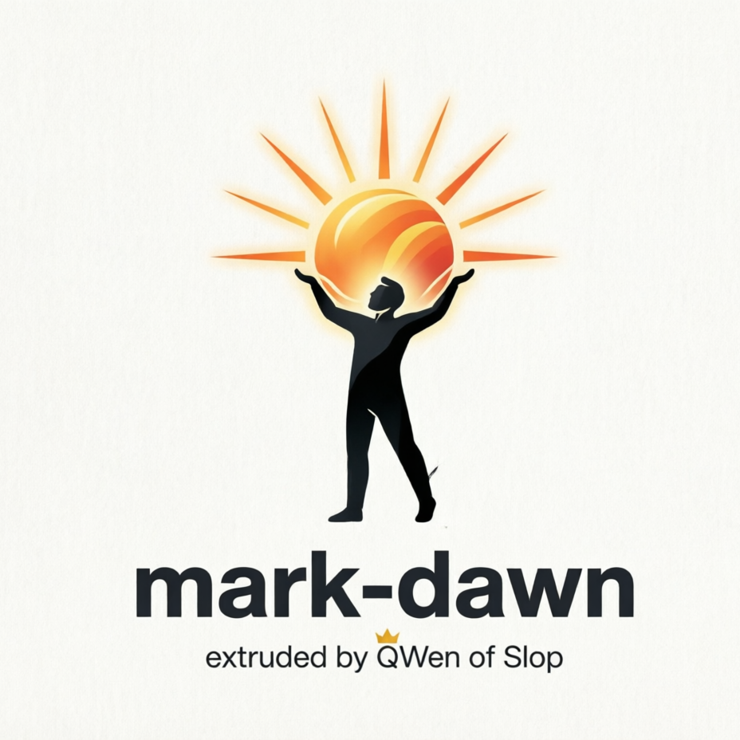

<p align="center">
  
</p>

# BEWARE
# !!!VIBE_SLOP_HAZARD!!!

## mark-dawn

**Universal Document to Markdown Pipeline** with auto-OCR for scanned PDFs.

Converts PDF, DOCX, XLSX, PPTX, HTML, CSV, RTF to clean Markdown with:
- 🧠 Smart detection of digital vs scanned PDFs
- 🔤 OCR for 6 languages: English, Russian, French, German, Chinese (Simplified), Japanese
- 📦 Fully containerized (Podman/Docker) — works on any system
- 👁️ Folder watcher mode: drop files into Inbox, get Markdown in Research

## Quick Start (one command)


```bash
curl -fsSL https://raw.githubusercontent.com/kirijin/mark-dawn/main/mark-dawn.sh -o mark-dawn
chmod +x mark-dawn
./mark-dawn start
```

```powershell
iwr -Uri "https://raw.githubusercontent.com/kirijin/mark-dawn/main/mark-dawn.ps1" -OutFile mark-dawn.ps1
.\mark-dawn.ps1 -Command start
```


## Requirements: Podman or Docker installed.

## Usage

### Linux / macOS
```
# Проверить, запущен ли
./mark-dawn status

# Остановить
./mark-dawn stop

# Запустить заново
./mark-dawn start

# Смотреть логи в реальном времени
./mark-dawn logs

# Обновить до последней версии
./mark-dawn update

# Сделать автозапуск при входе в систему
./mark-dawn install-systemd

# После install-systemd управление через systemctl:
systemctl --user status mark-dawn
systemctl --user stop mark-dawn
systemctl --user restart mark-dawn
journalctl --user -u mark-dawn -f    # логи через journalctl
```
### Windows (PowerShell)
```
# Запустить
.\mark-dawn.ps1 -Command start

# Остановить
.\mark-dawn.ps1 -Command stop

# Статус
.\mark-dawn.ps1 -Command status

# Логи
.\mark-dawn.ps1 -Command logs

# Обновить
.\mark-dawn.ps1 -Command update

# Автозапуск при входе в систему (Task Scheduler)
.\mark-dawn.ps1 -Command install-task

# После install-task управление через Task Scheduler:
Get-ScheduledTask -TaskName "mark-dawn" | Select-Object State
Stop-ScheduledTask -TaskName "mark-dawn"
Start-ScheduledTask -TaskName "mark-dawn"

# Удалить автозапуск
.\mark-dawn.ps1 -Command uninstall-task
```

## How It Works
```
    You drop a file into ~/Documents/Inbox/
    Watcher detects it (3s debounce)
    For digital PDFs (avg >100 chars/page) → pymupdf4llm → Markdown (fast)
    For scanned PDFs → ocrmypdf + Tesseract → pymupdf4llm → Markdown (slower)
    For Office files → markitdown → Markdown
    Result appears in ~/Documents/Research/<filename>.md
    Failed files moved to ~/Documents/Inbox_Failed/
```
### Directory Layout
```
~/Documents/
├── Inbox/         ← Drop files here
├── Research/      ← Converted Markdown appears here
└── Inbox_Failed/  ← Files that couldn't be converted
```
### Building Locally
```
git clone https://github.com/kirijin/mark-dawn.git
cd mark-dawn
podman build -t mark-dawn:latest .
MARK_DAWN_IMAGE=localhost/mark-dawn:latest ./mark-dawn.sh start
```
