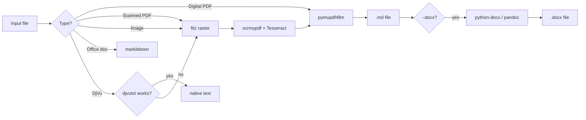

<p align="center">
  
</p>

<p align="center">
  <b>mark-dawn</b> — <i>drop a document, get clean Markdown.</i>
</p>

---

**mark-dawn** watches a folder, picks up any document you drop in, and converts it to readable Markdown (or styled DOCX). Handles scanned PDFs (OCR), digital PDFs, DjVu, photos of documents, and Office files — all through one pipeline.

| Platform | Status | Install method | Runtime |
|----------|--------|---------------|---------|
| Linux | ✅ stable | `curl ... install.sh \| bash` | Podman/Docker container |
| macOS 26+ | ✅ new | `curl ... install-macos-container.sh \| bash` | Apple Container (native, ~51 MB idle) |
| macOS pre-26 | ✅ new | `curl ... install.sh \| bash` | Homebrew + Python venv (no VM) |
| Windows | ❌ works but rough | PowerShell | MSYS2 portable (no admin) |

---

## Install

All installers are single-command, need no root/sudo, and put `mark-dawn` in `~/.local/bin/`.

### 🐧 **Linux** (any distro with podman or docker)
```bash
curl -fsSL https://raw.githubusercontent.com/kirijin/mark-dawn/main/install.sh | bash
```
Detects podman → docker. Downloads the container launcher, pulls the image on first start.

### 🍎 **macOS 26+ (Tahoe)** — Apple Container
```bash
curl -fsSL https://raw.githubusercontent.com/kirijin/mark-dawn/main/install-macos-container.sh | bash
```
Apple's native `container` CLI (ships with macOS 26). Per-container microVMs via Virtualization.framework. Fast startup (~1s), negligible idle RAM. No Docker Desktop, no Homebrew needed.

### 🍎 **macOS pre-26** — Homebrew + Python
```bash
curl -fsSL https://raw.githubusercontent.com/kirijin/mark-dawn/main/install.sh | bash
```
The universal installer auto-detects your macOS version. Pre-26 → runs the Homebrew path:
1. `brew install ocrmypdf tesseract-lang djvulibre pandoc`
2. Creates `/opt/mark-dawn/venv/` with full tool stack
3. Deploys the native launcher to `~/.local/bin/`
Zero container overhead — pure native Unix processes.

### 🪟 **Windows** — MSYS2 portable (no admin)
```powershell
iwr -Uri "https://raw.githubusercontent.com/kirijin/mark-dawn/main/mark-dawn.ps1" -OutFile "$env:TEMP\mark-dawn.ps1"; powershell -ExecutionPolicy Bypass -File "$env:TEMP\mark-dawn.ps1"
```
Downloads embedded Python + MSYS2 (tesseract, ghostscript, djvulibre). No admin, no package manager. Self-contained in `%USERPROFILE%\mark-dawn\`.

---

## Use

The CLI is the same on every platform:

```bash
mark-dawn start                 # Background watcher — watches ~/Documents/Inbox
mark-dawn stop                  # Stop the watcher
mark-dawn convert file.pdf      # Convert one file, get result in ~/Documents/Research/
mark-dawn convert scan.djvu --docx   # Convert to DOCX
mark-dawn logs                  # Follow watcher logs (Ctrl+C to exit)
mark-dawn status                # Show runtime state + directory contents
mark-dawn update                # Pull latest image / update Python packages
mark-dawn install-service       # Install as launchd (macOS) / systemd (Linux)
mark-dawn help                  # Full command reference
```

**Windows:**
```powershell
& "$env:USERPROFILE\mark-dawn\mark-dawn.bat" start
& "$env:USERPROFILE\mark-dawn\mark-dawn.bat" convert "C:\doc.pdf"
```

---

## How it works

### The flow

```
~/Documents/
├── Inbox/            ─── drop files here
│   ├── 2md/              → always converted to .md
│   └── 2docx/            → always converted to .docx
├── Research/          ← converted files appear here
└── Inbox_Failed/      ← files that failed conversion
```

1. You drop a file into `Inbox/` (or `Inbox/2docx/`)
2. Watcher detects it after 3s debounce (avoids mid-copy triggers)
3. File type is identified by extension:

| Extension | Handler | Notes |
|-----------|---------|-------|
| `.pdf` | Smart split | **Digital** (avg >100 chars/page) → pymupdf4llm direct. **Scanned** → render pages via fitz → OCR via ocrmypdf+Tesseract |
| `.djvu` | djvutxt / ddjvu | Native text extraction if available. Falls back to page render → OCR |
| `.tiff .jpeg .png .bmp .webp` | PIL → PDF → OCR | Rasterized to PDF at 300 DPI, then OCR'd |
| `.docx .xlsx .pptx .html .csv .rtf` | markitdown | Microsoft's document parser. Fast, no OCR |

4. Result: `Research/filename.md` (or `.docx` if `--docx` / in `2docx/`)
5. Original file deleted from Inbox on success, moved to `Inbox_Failed/` on failure

### OCR pipeline



### Smart PDF detection

`convert_pdf.py` opens a PDF with MuPDF, measures average text chars/page:
- **>100 chars/page** → digital. Direct pymupdf4llm conversion (fast, clean)
- **≤100 chars/page** → scanned. Renders each page at 200 DPI, feeds to ocrmypdf, then pymupdf4llm
- **Max pages**: 50 (configurable via `MARK_DAWN_MAX_PAGES`)
- **Max dimension**: 2400px (configurable via `MARK_DAWN_MAX_DIM`)

### Languages

OCR supports 6 languages by default, set via `MARK_DAWN_LANGS`:
```
eng+rus+fra+deu+chi_sim+jpn
```
Add your own: `MARK_DAWN_LANGS=eng+spa+ara+por mark-dawn start`

---

## Configuration

All via environment variables:

| Variable | Default | Used by |
|----------|---------|---------|
| `MARK_DAWN_DATA_DIR` | `~/Documents` | All — base data directory |
| `MARK_DAWN_LANGS` | `eng+rus+fra+deu+chi_sim+jpn` | OCR language pack |
| `MARK_DAWN_OUT_DIR` | `$DATA_DIR/Research` | Output destination |
| `MARK_DAWN_INBOX_DIR` | `$DATA_DIR/Inbox` | Input watch folder |
| `MARK_DAWN_FAILED_DIR` | `$DATA_DIR/Inbox_Failed` | Failed conversions |
| `MARK_DAWN_MAX_PAGES` | `50` | Max PDF pages to process |
| `MARK_DAWN_MAX_DIM` | `2400` | Max image dimension (px) |
| `MARK_DAWN_IMAGE` | `docker.io/kirijin/mark-dawn:latest` | Container image (Linux / macOS 26+) |
| `MARK_DAWN_INSTALL_DIR` | `/opt/mark-dawn` | macOS brew+venv home |
| `MARK_DAWN_CONVERTER` | auto-detected | Path to convert_pdf.py |

Also settable via `mark-dawn config set --data-dir ~/Docs --langs eng+spa`.

---

## Architecture by platform

### 🐧 Linux (container)

```
mark-dawn start
  → podman pull docker.io/kirijin/mark-dawn:latest
  → podman run -d --name mark-dawn [volumes] <image> watcher
```
- **Runtime**: Podman or Docker. No daemon, rootless.
- **Image**: Based on `jbarlow83/ocrmypdf`, + pandoc + tessdata + pymupdf4llm + markitdown + watchdog
- **Watcher persistence**: systemd user service (`mark-dawn install-systemd`)
- **Idle**: no RAM unless running (container starts on demand)

### 🍎 macOS 26+ (Apple Container)

```
mark-dawn start
  → container run -d --rm --name mark-dawn [volumes] --arch linux/arm64 <image> watcher
```
- **Runtime**: Apple's `container` CLI (ships with macOS 26 Tahoe)
- **VM model**: One microVM per container via Virtualization.framework. ~51 MB idle when no container runs.
- **Watcher persistence**: launchd user service (`mark-dawn install-service`)
- **Image**: Same Docker Hub image as Linux — pulled via `container image pull`

### 🍎 macOS pre-26 (Homebrew + Python)

```
mark-dawn start
  → /opt/mark-dawn/venv/bin/watcher.py
```
- **Runtime**: Native macOS processes — no VM, no container tax
- **System deps**: ocrmypdf, tesseract-lang, djvulibre, pandoc (installed via brew)
- **Python deps**: pymupdf4llm, markitdown[all], watchdog, python-docx (in venv)
- **Watcher persistence**: launchd user service (`mark-dawn install-service`)
- **Idle**: ~50 MB (Python interpreter + watchdog)

### 🪟 Windows (MSYS2 portable)

- **Runtime**: Native Windows processes, system tools via MSYS2 (mingw64)
- **No admin required**: self-contained in `%USERPROFILE%\mark-dawn\`
- **System deps**: tesseract, ghostscript, qpdf, djvulibre (via MSYS2 pacman)
- **Python**: embedded Python 3.12 (SHA256-verified download)
- **Watcher persistence**: Windows Scheduled Task (`install-task`)

---

## Project structure

```
mark-dawn/
├── install.sh                     # Linux + macOS universal entry point
├── install-macos.sh               # macOS version dispatcher (26+ vs pre-26)
├── install-macos-container.sh     # macOS 26+ installer (Apple Container)
├── install-macos-brew.sh          # macOS pre-26 installer (Homebrew + venv)
├── mark-dawn.sh                   # Linux container launcher (also macOS guard)
├── install.ps1                    # Windows installer
│
├── convert_pdf.py                 # Core converter — PDF/DjVu/image → markdown
├── watcher.py                     # Folder watcher (watchdog-based)
├── docx_styler.py                 # python-docx styled DOCX builder
│
├── entrypoint.sh                  # Container entrypoint (dispatches watcher/convert)
├── Dockerfile                     # Container image definition
│
├── libexec/
│   ├── mark-dawn-macos            # macOS brew+venv launcher
│   └── mark-dawn-container        # macOS Apple Container launcher
│
├── logo.png                       # Project logo
├── LICENCE                        # License
└── README.md                      # This file
```

---

## Building locally

```bash
git clone https://github.com/kirijin/mark-dawn.git
cd mark-dawn

# Container image (Linux / macOS 26+)
podman build -t mark-dawn:latest .
MARK_DAWN_IMAGE=localhost/mark-dawn:latest ./mark-dawn.sh start

# Or run Python scripts directly
pip install pymupdf4llm markitdown[all] watchdog python-docx
python3 convert_pdf.py ~/doc.pdf
python3 watcher.py                      # starts the watcher
```

---

## Comparison at a glance

| | Linux | macOS 26+ | macOS pre-26 | Windows |
|---|---|---|---|---|
| **Deploy** | `curl \| bash` | `curl \| bash` | `curl \| bash` | PowerShell |
| **Engine** | podman/docker | Apple Container | native brew+venv | MSYS2 portable |
| **Background** | systemd user | launchd | launchd | Scheduled Task |
| **Idle RAM** | ~0 (cold) | ~51 MB | ~50 MB | ~80 MB |
| **Image/stack** | Docker Hub | Docker Hub | brew + pip | embedded |
| **Root/sudo** | no | no | no | no |
| **OCR languages** | 6 (extensible) | 6 | 6 | 25 (full tessdata) |
| **Maturity** | ✅ stable | 🆕 fresh | 🆕 fresh | ⚠️ works but rough |

---

## Credits

- [pymupdf4llm](https://pypi.org/project/pymupdf4llm/) — PDF→Markdown via MuPDF
- [markitdown](https://pypi.org/project/markitdown/) — Office docs→Markdown (Microsoft)
- [ocrmypdf](https://github.com/ocrmypdf/ocrmypdf) — OCR pipeline for scanned PDFs
- [Tesseract](https://github.com/tesseract-ocr/tesseract) — OCR engine
- [djvulibre](https://djvu.sourceforge.net/) — DjVu processing
- [watchdog](https://pypi.org/project/watchdog/) — filesystem watcher
